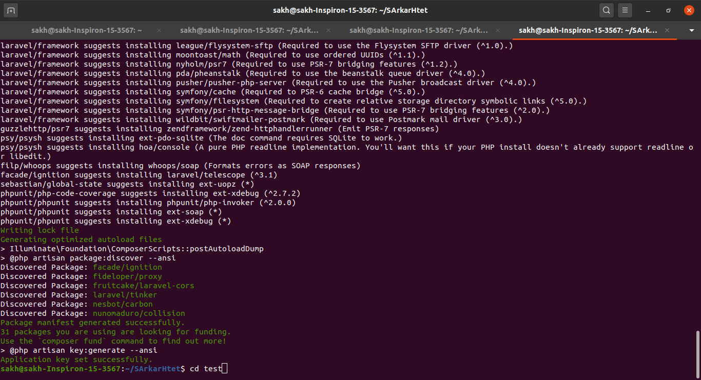
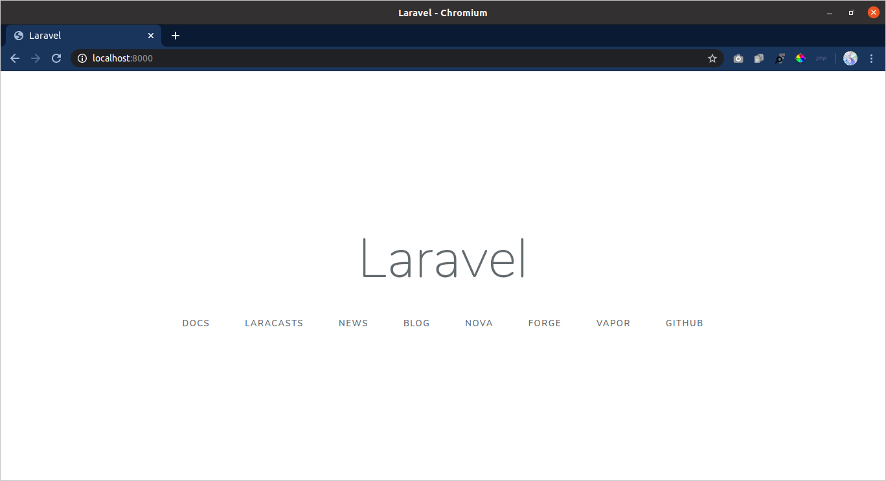

# Installation

* [**Installation**](#installation)
  * [Server Requirements](#server-requirements)
  * [Installing Laravel](#installing-laravel)
  * [Configuration](#configuration)
* [**Web Server Configuration**](#wsc)
  * [Directory Configuration](#dc)
  * [Pretty URL](#pretty-url)

## Installation

### **Server Requirements**

Laravel 7 frameworkကို [Laravel Homestead](https://laravel.com/docs/7.x/homestead)နဲ့ installလုပ်ခဲ့ရင် requriementsတွေမရှိဘဲ လုပ်နိုင်ပေမယ့် Homesteadမသုံးခဲ့ရင်တော့ အောက်ပါ requriementsတွေ လိုအပ်ပါလိမ့်မယ်။

* PHP >= 7.2.5
* BCMath PHP Extension
* Ctype PHP Extension
* Fileinfo PHP extension
* JSON PHP Extension
* Mbstring PHP Extension
* OpenSSL PHP Extension
* PDO PHP Extension
* Tokenizer PHP Extension
* XML PHP Extension

### **Installing Laravel**

Laravelက သူ့ရဲ့ dependenciesတွေကို manageလုပ်ဖို့ [Composer](https://getcomposer.org/)ကို အသုံးချပါတယ်။ ဒါကြောင့် Laravelကို installမလုပ်ခင် ကိုယ့်စက်ထဲမှာ Composerရှိလား မရှိလားအရင်စစ်ပါ။ မရှိရင် https://getcomposer.org/ ကိုသွားပြီး Composerကို အရင်installလုပ်ပါ။  

>windowဆို command prompt, Linuxဆို terminalမှာ `composer -v` လို့ရိုက်ပြီး composerရှိမရှိကို စစ်ဆေးနိုင်ပါတယ်။  

ဒီမှာတစ်ခုပြောချင်တာက Laravel Install လုပ်နည်းနှစ်မျိုးရှိပါတယ်။  
1. Laravel Installerမှတစ်ဆင့် installလုပ်နည်း
2. Composer Create-Projectမှ တစ်ဆင့် installလုပ်နည်း  

ကျွန်တော်အခုပြောမယ့်နည်းကတော့ လူတိုင်းအတွက်လွယ်ကူတဲ့ Composer Create-Projectကတစ်ဆင့်လုပ်နည်းကို ပြောပြပေးမှာပါ။ 

#### **Via Composer Create-Project**

မင်းရဲ့ terminal or command promptမှာ အောက်က codeလေးရိုက်ထည့်လိုက်ပါ

> `composer create-project --prefer-dist laravel/laravel test`

နောက်က `test` ဆိုတာလေးက မင်းရဲ့ project nameပေါ့။ installတင်ပြီးသွားရင် မင်းရဲ့ project folderထဲကို ဝင်ပါ။  

`cd test`

  

#### **Local Development Server**

Laravel installလည်းလုပ်ပြီးပြီ မင်းရဲ့ projectထဲလည်း ဝင်ပြီးပြီဆိုရင် မင်းရဲ့ applicationကို Local serverမှာ runဖို့ `php artisan serve` commandကို သုံးရပါမယ်။  

> `php artisan serve`  

ဒီcommandကို runပြီးရင် နှစ်သက်ရာ browserတစ်ခုဖွင့်ပြီး search barမှာ `localhost:8000`ဆိုပြီး ထည့်လိုက်ပါ။ အောက်က ပုံလိုတွေ့ရမယ်ဆို မင်းရဲ့ laravel application install တင်ပြီး runတာ အောင်မြင်သွားပါပြီ။  

